# tart-omarchy

Native **ARM64 Tart VM image of Omarchy 4 (Quattro)** for Apple Silicon Macs (M1/M2/M3/M4).  
Boots directly into the Omarchy Hyprland Wayland desktop with full-width 16:10 display support.

---

## Quick Start (Run the Pre-built Image)

### 1. Install Tart
If you don't have [Tart](https://tart.run/) installed:
```bash
brew install cirruslabs/cli/tart
```

### 2. Pull and Clone the VM Image
Pull the pre-built, ready-to-run OCI image directly from GitHub Container Registry:
```bash
tart clone ghcr.io/chrisdoc/tart-omarchy:latest omarchy
```
*(Or pull a specific release tag, e.g. `ghcr.io/chrisdoc/tart-omarchy:4.0.2`)*

### 3. Launch the Desktop VM
```bash
tart run omarchy
```

---

## VM Credentials & Daily Use

- **Default User**: `omarchy`
- **Default Password**: `omarchy`
- **Root Access**: `sudo` (passwordless)

### Common Commands

#### SSH Access
Once you enable SSH in Omarchy (`omarchy-setup-security-sshd` or firewall settings):
```bash
ssh omarchy@$(tart ip omarchy)
```

#### Adjusting CPU & Memory
```bash
# Allocate 8 CPUs and 16 GB of RAM
tart set omarchy --cpu 8 --memory 16384
```

#### Changing Display Resolution
```bash
# Configure resolution with dynamic window refit
tart set omarchy --display 1512x982pt --display-refit
```

#### Stop or Delete the VM
```bash
tart stop omarchy
tart delete omarchy
```

---

## About Omarchy on Apple Silicon

Omarchy's official ISO is x86_64-only and cannot boot on Apple Silicon virtualization. This project provides a native ARM64 build running on Apple's `Virtualization.framework` using:
- **Arch Linux ARM (`aarch64`)**: Core base system, kernel (`Image`), and initramfs.
- **[omarchy-mac](https://github.com/omarchy-mac/omarchy-mac)** (Quattro branch): The community aarch64 port of Omarchy 4.0.2 with native ARM64 package builds.
- **Mesa `llvmpipe` Software Rendering**: Configured with `LIBGL_ALWAYS_SOFTWARE=1` and `WLR_RENDERER_ALLOW_SOFTWARE=1` to run Hyprland Wayland smoothly on Apple Virtualization.framework without requiring proprietary GPU drivers.
- **VirtioFS Package Caching**: Caches downloaded packages in `.build/pkg-cache` for instant rebuilds.

---

## Building From Source (Developers)

### Prerequisites
```bash
brew install cirruslabs/cli/tart hashicorp/tap/packer
```

### Build Command
```bash
# Build default version (Omarchy 4.0.2)
./build-tart.sh

# Or specify a custom version
OMARCHY_VERSION=4.0.2 ./build-tart.sh
```

### How the Build Pipeline Works

```mermaid
sequenceDiagram
    autonumber
    actor Dev as Developer / CI
    participant Host as macOS Host
    participant Packer as Packer (tart-cli)
    participant Builder as Ubuntu Builder VM
    participant Chroot as Arch Linux ARM Chroot
    participant TargetDisk as Target Disk (/dev/vdb)
    participant GHCR as GitHub Container Registry

    Dev->>Host: Run ./build-tart.sh
    Note over Host: 1. Download ALARM rootfs<br/>2. Create 40 GB sparse disk (.build/rootdisk.img)<br/>3. Setup VirtioFS pkg-cache

    Host->>Packer: Start Packer build (omarchy.pkr.hcl)
    Packer->>GHCR: Pull base VM (cirruslabs/ubuntu:latest)
    Packer->>Builder: Boot base VM & Upload rootfs + provision.sh over SSH
    Builder-->>Packer: Assets staged & VM shut down
    Packer-->>Host: Base VM ready

    Host->>Builder: Boot VM headless with --disk /dev/vdb & --dir pkg-cache
    Host->>Builder: Launch provision.sh via tart exec (detached)

    rect rgb(30, 40, 50)
        Note over Builder,TargetDisk: In-Guest Provisioning
        Builder->>TargetDisk: Partition GPT: 512MB ESP (vdb1) + 40GB ext4 Root (vdb2)
        Builder->>TargetDisk: Extract ALARM rootfs to /target
        Builder->>TargetDisk: Mount ESP to /target/boot/efi & bind VirtioFS cache
        Builder->>Chroot: Enter chroot & initialize pacman keyring
        Chroot->>Chroot: Install base packages (kernel, systemd, networking)
        Chroot->>TargetDisk: Install GRUB EFI removable bootloader
        Chroot->>Chroot: Configure Mesa llvmpipe software rendering
        Chroot->>Chroot: Build & install Omarchy 4.0.2 packages (omarchy-mac)
        Chroot->>TargetDisk: Write BUILD-STATUS == OK to ESP
    end

    Builder-->>Host: Builder VM powers down
    Host->>TargetDisk: Mount ESP out-of-band & verify BUILD-STATUS == OK
    Host->>Host: Swap .build/rootdisk.img into ~/.tart/vms/omarchy/disk.img
    Host->>Host: Set display resolution (1512x982pt, --display-refit)

    Note over Host,Dev: Build Complete: Native ARM64 Omarchy VM Ready
```


---

## Verification with Cua Driver

The desktop environment and display state are verified using [Cua Driver](https://cua.ai):
```bash
# Discover running Tart window
cua-driver call --tool list_windows --args '{}'

# Inspect accessibility tree & layout
cua-driver call --tool get_window_state --args '{"pid": <PID>, "window_id": <WINDOW_ID>, "include_screenshot": false}'
```

---

## Publishing to GHCR (Maintainers)

```bash
gh auth refresh -s write:packages
gh auth token | tart login ghcr.io --username <username> --password-stdin
tart push omarchy ghcr.io/<username>/tart-omarchy:4.0.2 ghcr.io/<username>/tart-omarchy:latest
```